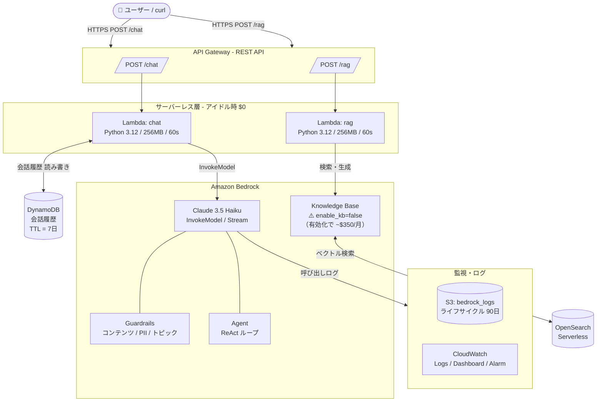
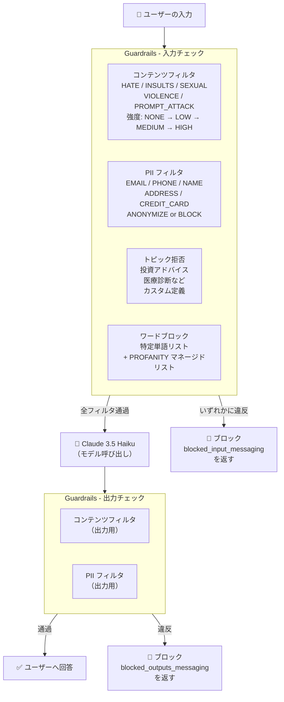
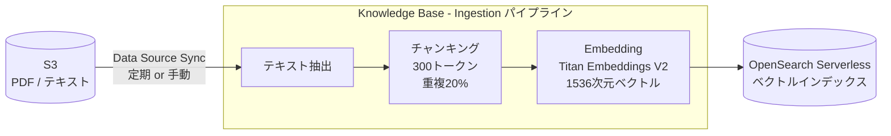
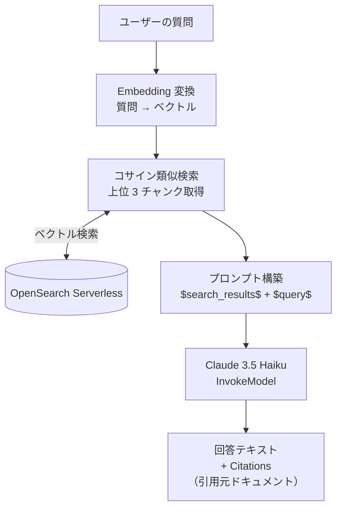
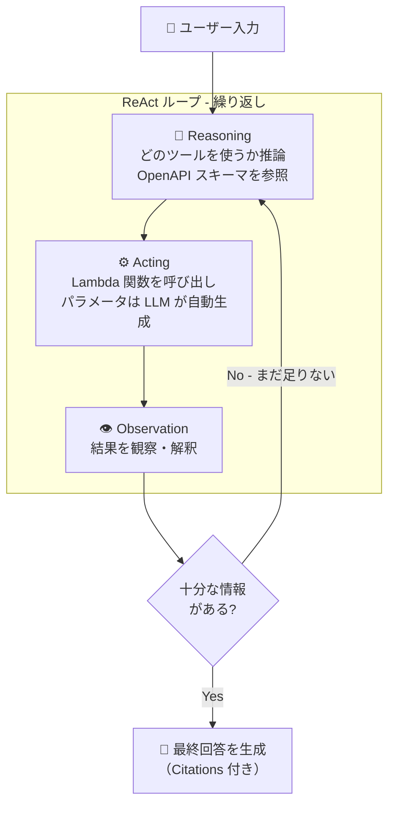
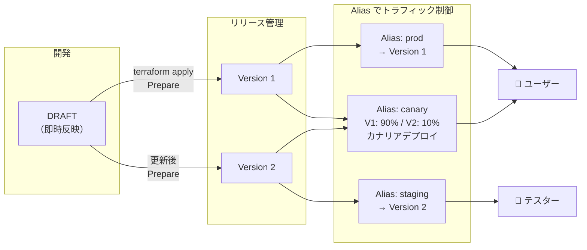

# AWS Bedrock Demo — Terraform インフラ

**目標**: Terraform で Amazon Bedrock × Claude を素早くデプロイし、主要機能をひと通り体験する  
**方針**: アイドル時 $0 のサーバーレス構成で Bedrock の全主要機能を網羅

---

## 目次

1. [アーキテクチャ概要](#アーキテクチャ概要)
2. [ファイル構成](#ファイル構成)
3. [クイックスタート](#クイックスタート)
4. [機能フラグ一覧](#機能フラグ一覧)
5. [コスト試算](#コスト試算)
6. [API 使用例](#api-使用例)
7. [機能リファレンスマップ](#機能リファレンスマップ)
8. [各リソースの学習ポイント](#各リソースの学習ポイント)
9. [よくある問題と対処法](#よくある問題と対処法)
10. [本番化チェックリスト](#本番化チェックリスト)

---

## アーキテクチャ概要



### リソース一覧とアイドルコスト

| リソース | 役割 | アイドル課金 |
|---|---|---|
| API Gateway (REST) | HTTP エンドポイント | $0 |
| Lambda × 2 | Chat / RAG ハンドラー | $0 |
| DynamoDB (PAY_PER_REQUEST) | 会話履歴 (TTL=7日) | $0 |
| S3 × 2 | ドキュメント / ログ格納 | ~$0.023/GB/月 |
| Bedrock Guardrails | 入出力安全フィルタ | $0（呼び出し時のみ） |
| Bedrock Agent | マルチステップ実行 | $0（呼び出し時のみ） |
| **Knowledge Base** | **RAG ベクトルDB** | **⚠️ ~$350/月**（デフォルト無効） |
| CloudWatch Logs | ログ・ダッシュボード | ~$0.50/月（7日保持） |

---

## ファイル構成

```
bedrock_demo/
├── main.tf                    # プロバイダー設定・Terraform バージョン固定
├── variables.tf               # 全変数定義（コメント付き）
├── locals.tf                  # 命名プレフィックス・共通タグ
├── outputs.tf                 # apply 後に表示される API URL 等
│
├── s3.tf                      # ドキュメントバケット + ログバケット
├── dynamodb.tf                # 会話履歴テーブル（TTL・暗号化）
├── iam.tf                     # IAM ロール/ポリシー（最小権限）
├── lambda.tf                  # Lambda 関数定義 + ロググループ
├── api_gateway.tf             # REST API（/chat, /rag）+ CORS
│
├── bedrock_guardrails.tf      # コンテンツフィルタ・PII・トピック拒否
├── bedrock_knowledge_base.tf  # RAG ナレッジベース（デフォルト無効）
├── bedrock_agent.tf           # エージェント + Action Group + Alias
├── cloudwatch.tf              # モデル呼び出しログ・ダッシュボード・アラーム
│
└── lambda/
    ├── chat/
    │   └── handler.py         # InvokeModel + 会話履歴管理
    └── rag/
        └── handler.py         # RetrieveAndGenerate / Retrieve
```

---

## クイックスタート

### 1. 前提条件の確認

```bash
# Terraform のバージョン確認（1.6.0 以上必要）
terraform --version

# AWS CLI の確認と認証設定
aws --version
aws configure              # アクセスキー・リージョン等を設定
aws sts get-caller-identity  # 認証が通っているか確認
```

### 2. 必要な IAM 権限

デプロイするユーザー/ロールに以下のマネージドポリシーを付与してください：

```
AmazonBedrockFullAccess
AWSLambda_FullAccess
AmazonAPIGatewayAdministrator
AmazonDynamoDBFullAccess
AmazonS3FullAccess
IAMFullAccess
CloudWatchFullAccess
AmazonOpenSearchServiceFullAccess  # enable_knowledge_base=true 時のみ
```

> 本番環境では PowerUserAccess + IAMFullAccess で代替可能

### 3. デプロイ

```bash
cd infra/bedrock_demo

# ① 初期化（プロバイダーのダウンロード）
terraform init

# ② 変更内容の確認（必ず実行）
terraform plan

# ③ デプロイ（yes を入力）
terraform apply

# apply 完了後、出力例:
# chat_endpoint    = "https://xxxxxx.execute-api.us-east-1.amazonaws.com/dev/chat"
# rag_endpoint     = "https://xxxxxx.execute-api.us-east-1.amazonaws.com/dev/rag"
# dashboard_url    = "https://us-east-1.console.aws.amazon.com/cloudwatch/..."
```

### 4. 動作確認

```bash
# Chat API テスト
curl -X POST $(terraform output -raw chat_endpoint) \
  -H "Content-Type: application/json" \
  -d '{"message": "AWSのBedrockとは何ですか？", "session_id": "test-001"}'

# 期待レスポンス:
# {
#   "session_id": "test-001",
#   "response": "Amazon Bedrockは...",
#   "model": "anthropic.claude-3-5-haiku-20241022-v1:0",
#   "usage": {"input_tokens": 25, "output_tokens": 150}
# }
```

### 5. 削除（重要！）

```bash
# ⚠️ 学習後は必ず実行してください（特に Knowledge Base を有効化した場合）
terraform destroy
```

---

## 機能フラグ一覧

`variables.tf` または `-var` オプションで制御できます。

```bash
# Knowledge Base を有効化（⚠️ 月額 ~$350 追加）
terraform apply -var="enable_knowledge_base=true"

# モデルを Sonnet に変更（精度向上、コスト増）
terraform apply -var='bedrock_model_id=anthropic.claude-3-5-sonnet-20241022-v2:0'

# 東京リージョンに変更（利用可能モデルが限定的）
terraform apply -var="aws_region=ap-northeast-1"

# ガードレールを無効化
terraform apply -var="enable_guardrails=false"

# エージェントを無効化
terraform apply -var="enable_agent=false"
```

---

## コスト試算

### アイドル時（deploy したまま何もしない）

| 項目 | 月額 |
|---|---|
| S3 (2バケット × 最小) | ~$0.02 |
| CloudWatch Logs (7日保持) | ~$0.50 |
| **合計** | **< $1** |

### 学習時（月200リクエスト、平均500トークン入力・200トークン出力）

```
Claude 3.5 Haiku:
  入力: 200 × 500 tokens × $0.0008 / 1000 = $0.08
  出力: 200 × 200 tokens × $0.004  / 1000 = $0.16
  合計: $0.24

Lambda: 200回 × 最大無料枠 → 実質 $0
API Gateway: 200回 × $3.50/1M = $0.001
DynamoDB: PAY_PER_REQUEST → $0.01 以下

総計: ~$0.80 / 月
```

### Knowledge Base を有効化した場合（1ヶ月常時起動）

```
OpenSearch Serverless: 2 OCU × $0.24/時 × 720時間 = ~$346
上記の学習コスト: $0.80
─────────────────────────────
合計: ~$347 / 月 ⚠️
```

> **結論**: Knowledge Base は「apply → 学習（数時間）→ destroy」のサイクルで使う。  
> 数時間なら $0.24/時 × 2 OCU × 数時間 = 数ドル で済む。

---

## API 使用例

### Chat API（`/chat`）

```bash
# 基本会話
curl -X POST $API_URL/chat \
  -H "Content-Type: application/json" \
  -d '{"message": "RAGとファインチューニングの違いを説明してください"}'

# 会話継続（session_id を使い回す）
curl -X POST $API_URL/chat \
  -H "Content-Type: application/json" \
  -d '{"message": "その続きで、どちらがコスト効率が良いですか？",
       "session_id": "my-session-123"}'

# ストリーミング（レスポンスを少しずつ受け取る）
curl -X POST $API_URL/chat \
  -H "Content-Type: application/json" \
  -d '{"message": "Transformerアーキテクチャを詳しく説明してください",
       "stream": true}'
```

### RAG API（`/rag`）— Knowledge Base 有効時のみ

```bash
# 検索 + 生成（引用付き回答）
curl -X POST $API_URL/rag \
  -H "Content-Type: application/json" \
  -d '{"query": "Bedrockで使えるClaudeモデルの種類と料金は？"}'

# 検索のみ（ソースドキュメントを確認）
curl -X POST $API_URL/rag \
  -H "Content-Type: application/json" \
  -d '{"query": "Knowledge Baseのチャンキング設定",
       "retrieve_only": true}'
```

### DynamoDB で会話履歴を確認

```bash
# 直接確認する場合
aws dynamodb query \
  --table-name bedrock-demo-dev-conversations \
  --key-condition-expression "session_id = :sid" \
  --expression-attribute-values '{":sid": {"S": "my-session-123"}}'
```

---

## 機能リファレンスマップ

### AI/ML 基礎概念

| 概念 | 実装場所 | ポイント |
|---|---|---|
| 基盤モデル (FM) | `variables.tf` | InvokeModel でどのモデルも同一 API で呼べる |
| トークン化 | `lambda/chat/handler.py` | `max_tokens` = 出力の上限（入力は別途カウント） |
| 埋め込み (Embeddings) | `bedrock_knowledge_base.tf` | Titan Embeddings V2 = 1536次元ベクトル |
| ベクトル類似検索 | `bedrock_knowledge_base.tf` | コサイン類似度で意味的に近いチャンクを検索 |
| コンテキストウィンドウ | `lambda/chat/handler.py` | `_get_history(limit=10)` で直近10往復に制限 |
| ハルシネーション対策 | `lambda/rag/handler.py` | 「文書にない情報は"わかりません"」プロンプト |

### Bedrock 主要機能

| 機能 | 実装ファイル | ポイント |
|---|---|---|
| **InvokeModel** | `lambda/chat/handler.py` | Anthropic Messages API 形式、`bedrock-2023-05-31` |
| **ストリーミング** | `lambda/chat/handler.py` | `invoke_model_with_response_stream` → SSE |
| **Guardrails** | `bedrock_guardrails.tf` | DRAFT → バージョン番号 → Alias の管理 |
| **Knowledge Base** | `bedrock_knowledge_base.tf` | S3 → Embedding → AOSS の ingestion フロー |
| **Agent** | `bedrock_agent.tf` | ReAct ループ、Action Group、Alias/Version |
| **RAG** | `lambda/rag/handler.py` | RetrieveAndGenerate vs Retrieve の違い |

### セキュリティ & ガバナンス

| 概念 | 実装ファイル | ポイント |
|---|---|---|
| 最小権限 IAM | `iam.tf` | サービスごとに独立ロール、ワイルドカード最小化 |
| VPC エンドポイント | `bedrock_knowledge_base.tf` | `AllowFromPublic = false` で内部通信 |
| Guardrails PII | `bedrock_guardrails.tf` | ANONYMIZE(匿名化) vs BLOCK(完全拒否)の使い分け |
| モデル呼び出しログ | `cloudwatch.tf` | 監査・コンプライアンスに必須 |
| S3 暗号化 | `s3.tf` | SSE-S3(低コスト) vs SSE-KMS(監査ログあり) |
| データ保持 | `dynamodb.tf` | TTL で個人データを自動削除（プライバシー準拠） |

### コスト最適化

| 戦略 | 実装箇所 | ポイント |
|---|---|---|
| サーバーレス | Lambda + API GW + DynamoDB PAY_PER_REQUEST | アイドル時 $0 |
| モデル選択 | `variables.tf` | Haiku < Sonnet < Opus（コスト順） |
| Knowledge Base 無効デフォルト | `variables.tf` | OpenSearch Serverless = 最大コスト要因 |
| ログ保持短縮 | `variables.tf` | log_retention_days = 7 で CloudWatch コスト削減 |
| S3 ライフサイクル | `s3.tf` | Standard → IA(30日) → 削除(90日) |
| DynamoDB TTL | `dynamodb.tf` | 古い会話履歴を自動削除 |

---

## 各リソースの学習ポイント

### Bedrock Guardrails（`bedrock_guardrails.tf`）



バージョン管理: `DRAFT` → `aws_bedrock_guardrail_version` で番号付きバージョンに昇格。本番環境では必ずバージョン番号を固定すること（DRAFT は変更が即反映されるため危険）。

### Bedrock Knowledge Base（`bedrock_knowledge_base.tf`）

**Ingestion フロー**（S3 のドキュメントをベクトルDBに取り込む）



**検索フロー**（RetrieveAndGenerate API の動き）



**チャンキング戦略の比較**

| 戦略 | 精度 | コスト | 用途 |
|---|---|---|---|
| `FIXED_SIZE` | 普通 | 安い | シンプルな FAQ |
| `HIERARCHICAL` | 高い | 中程度 | 長文ドキュメント |
| `SEMANTIC` | 最高 | 高い（LLM使用） | 意味の境界を正確に分割 |
| `NONE` | - | 最安 | ドキュメント単位で検索 |

### Bedrock Agent（`bedrock_agent.tf`）

**ReAct ループ**（Reasoning + Acting）



**Action Group / バージョン管理**



### IAM 最小権限設計（`iam.tf`）

```
ロール分離:
  aws_iam_role.lambda_exec     → Lambda 関数の実行ロール
  aws_iam_role.knowledge_base  → Bedrock が S3/AOSS にアクセス
  aws_iam_role.bedrock_agent   → Agent が Lambda/モデルを呼び出す
  aws_iam_role.bedrock_logging → Bedrock がログを S3 に書き込む

試験頻出 Action:
  bedrock:InvokeModel                → モデル直接呼び出し（必須）
  bedrock:InvokeModelWithResponseStream → ストリーミング
  bedrock:Retrieve                   → Knowledge Base 検索
  bedrock:RetrieveAndGenerate        → RAG（検索＋生成）
  bedrock:InvokeAgent                → エージェント実行
  bedrock:ApplyGuardrail             → ガードレール事後適用

Trust Policy:
  lambda.amazonaws.com  → Lambda が AssumeRole
  bedrock.amazonaws.com → Bedrock が AssumeRole
    ConditionのSourceAccountが重要（混乱した代理問題の防止）
```

---

## よくある問題と対処法

### エラー: `ResourceNotFoundException: Knowledge Base not configured`

RAG API に対して Knowledge Base が無効の状態でリクエストした場合に発生。

```bash
# 解決策1: Knowledge Base を有効化（コスト注意）
terraform apply -var="enable_knowledge_base=true"

# 解決策2: Chat API を使用する（/chat エンドポイント）
curl -X POST $API_URL/chat -H "Content-Type: application/json" \
  -d '{"message": "あなたの質問"}'
```

### エラー: `ThrottlingException`

Bedrock のレート制限（Service Quota）に達した場合。

```bash
# 現在のクォータを確認
aws service-quotas list-service-quotas --service-code bedrock

# 解決策: 指数バックオフでリトライ（handler.py に実装済み）
# 急ぎの場合は AWS コンソールからクォータ引き上げをリクエスト
```

### エラー: `AccessDeniedException: User is not authorized to perform bedrock:InvokeModel`

モデルのアクセス有効化が必要な場合。

```bash
# AWS コンソール → Amazon Bedrock → モデルアクセス → リクエスト
# 東京リージョンでは一部モデルが利用不可なため us-east-1 を使用推奨
```

### terraform apply でハング（Knowledge Base 作成時）

OpenSearch Serverless コレクションの作成に 5〜10 分かかることがある。待ってください。

---

## 本番化チェックリスト

API キー / 認証を追加する場合:

- [ ] API Gateway に API キー認証または AWS_IAM 認証を追加
- [ ] Lambda の環境変数をシークレットマネージャーに移行
- [ ] S3 バケットの `force_destroy = false` に変更
- [ ] DynamoDB の `point_in_time_recovery = true` に変更
- [ ] CloudWatch アラームのメール通知（SNS）を設定
- [ ] `log_retention_days = 30` 以上に変更（監査対応）
- [ ] Guardrails の DRAFT を本番バージョンに昇格
- [ ] Terraform リモートバックエンド（S3 + DynamoDB ロック）を設定
- [ ] Terraform Workspaces で dev / stg / prod を分離

---

## 参考資料

- [Amazon Bedrock ドキュメント](https://docs.aws.amazon.com/bedrock/latest/userguide/)
- [Bedrock 料金表](https://aws.amazon.com/bedrock/pricing/)
- [Anthropic Claude API ドキュメント](https://docs.anthropic.com/claude/reference/messages_post)
- [Bedrock Guardrails ドキュメント](https://docs.aws.amazon.com/bedrock/latest/userguide/guardrails.html)
- [OpenSearch Serverless 料金](https://aws.amazon.com/opensearch-service/pricing/#Amazon_OpenSearch_Serverless)
